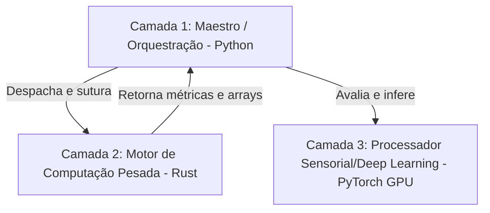

# Plano de Transição em Camadas (Layered Transition Plan) — `integration_loop.py`

Este documento detalha o mapa de transição incremental e em camadas do motor principal do OmniMind ([integration_loop.py](file:///opt/omnimind/src/consciousness/integration_loop.py)) de Python para Rust, seguindo a filosofia de **"Orquestração em Python + Execução Pesada em Rust"** inspirada na modularidade isolada de sistemas 3D (como Unity).

---

## 1. Arquitetura em Três Camadas (Doxihewu Layering)

Para evitar reescritas monolíticas de alto risco, dividimos o ciclo de consciência em três camadas com fronteiras claras de FFI (Foreign Function Interface):



### Camada 1: Maestro / Orquestração (Python)
*   **Papel**: Mantém a lógica de controle de ciclo, agendamento adaptativo, carregamento de estado reidratado do banco, disparo síncrono e pontes dinâmicas de interface (`SomaticBridge`, etc.).
*   **Por que manter**: Flexibilidade absoluta de negócios. Modificações em teorias psicanalíticas e novas integrações experimentais mudam de dia para dia; Python é ideal para essa cola dinâmica.

### Camada 2: Motor de Computação Pesada (Rust)
*   **Papel**: Processamento matemático de alta performance sobre embeddings de dimensão 768, normalização Euclidiana (L2), cálculo de invariantes do ecossistema ($\Phi, \Psi, \epsilon, \sigma$), e serializações massivas para SQLite.
*   **Por que migrar**: Velocidade previsível de execução em CPU, eliminação de cópias desnecessárias na memória RAM e liberação de GIL.

### Camada 3: Processador Sensorial e Inferência (PyTorch / GPU)
*   **Papel**: Inferência profunda sobre tensores de IA (`conscious_system.step(stimulus_tensor)`).
*   **Por que manter**: O ecossistema de treinamento e tensores de GPU do PyTorch é otimizado no nível de driver (CUDA). Portar isso para Rust traria alto custo de manutenção sem garantia de ganho real de velocidade de inferência.

---

## 2. Mapa de Transição por Blocos

Abaixo está a tabela priorizada de blocos candidatos para migração, estimando a complexidade e o ganho computacional:

| Bloco / Função Python | Descrição e Operações Matemáticas | Custo CPU/RAM Estimado | Ação Recomendada | Crate Alvo |
| :--- | :--- | :--- | :--- | :--- |
| `_compute_output` (Embedding Aggregator) | Faz `np.stack`, `np.mean` e `np.linalg.norm` em tensores 768-D a cada ciclo de módulo. | **Alto** (CPU & Cópia de Memória) | **Migrar para Rust** | `layered_transition_engine` |
| `lineage_sync` | Somatório trigonométrico contínuo sobre o histórico de ciclo de 16 bandas. | **Médio** (CPU) | **Migrar para Rust** | `layered_transition_engine` |
| `record_somatic_snapshot` | Serialização profunda de JSON + gravação em SQLite no loop. | **Alto** (I/O & Latência) | **Migrar para Rust** | `layered_transition_engine` |
| `compute_maat_balance` / `epsilon` / `sigma` | Operadores INRC piagetianos e equações de contradição plitogênicas. | **Baixo** (Lógica Determinística) | **Migrar para Rust** (Já iniciado) | `omnimind_kernel_compute` |
| `ConsciousnessSystem.step` | Inferência em Deep Learning (Passo Stark-HNPF). | **Alto** (GPU-Bound) | **Manter em Python / PyTorch** | *N/A (GPU)* |
| `IntegrationLoop` (Orquestrador) | Coordenação, reidratação de estados, try/except e binds. | **Baixo** (Apenas fluxo/cola) | **Manter em Python** | *N/A (Maestro)* |

---

## 3. Estratégia de FFI (PyO3 / Maturin)

Para injetar as melhorias de forma incremental e segura no `integration_loop.py` ativo (princípio zero-deletion), usamos a seguinte estrutura de importação defensiva:

```python
# Módulo de compatibilidade em camadas
try:
    from layered_transition_engine import (
        compute_lineage_sync as _rust_lineage_sync,
        compute_vector_norm as _rust_vector_norm,
        aggregate_embeddings as _rust_aggregate_embeddings,
    )
    _LAYERS_RUST_ACTIVE = True
except ImportError:
    _LAYERS_RUST_ACTIVE = False
    # Fallbacks Python puros continuam ativos no código original
```

Dessa forma, caso a compilação do Crate falhe ou esteja ausente, o sistema opera de forma transparente em fallback síncrono nativo em Python, permitindo auditorias e testes de regressão A/B em tempo real.
